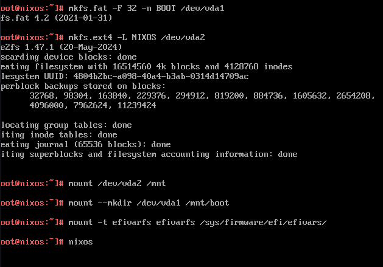
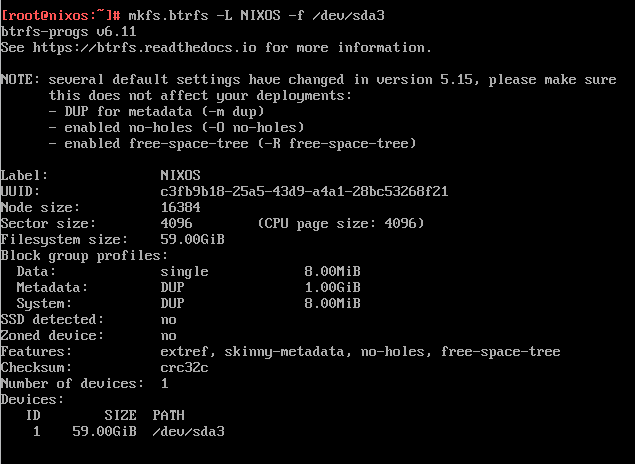
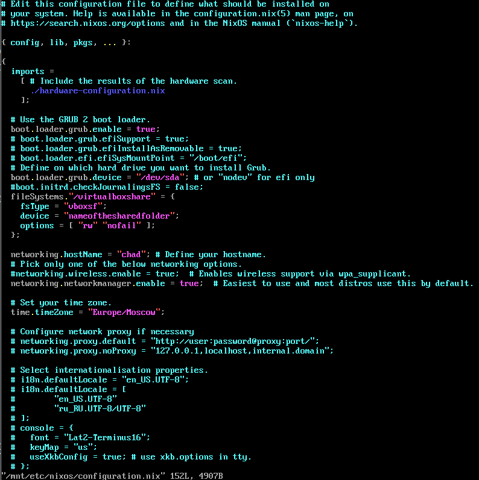
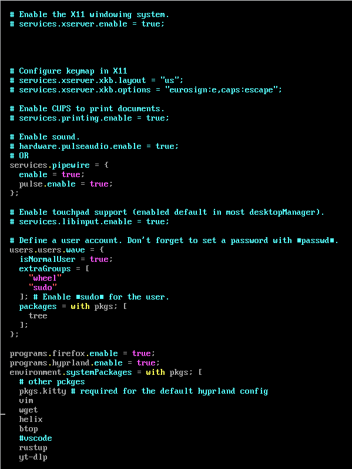
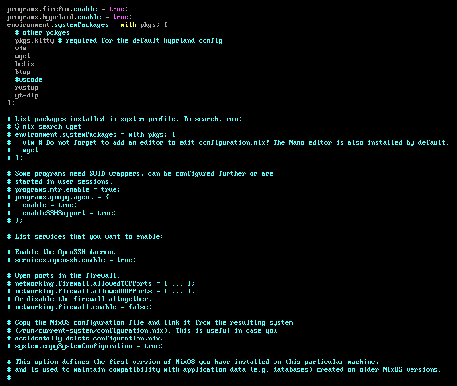
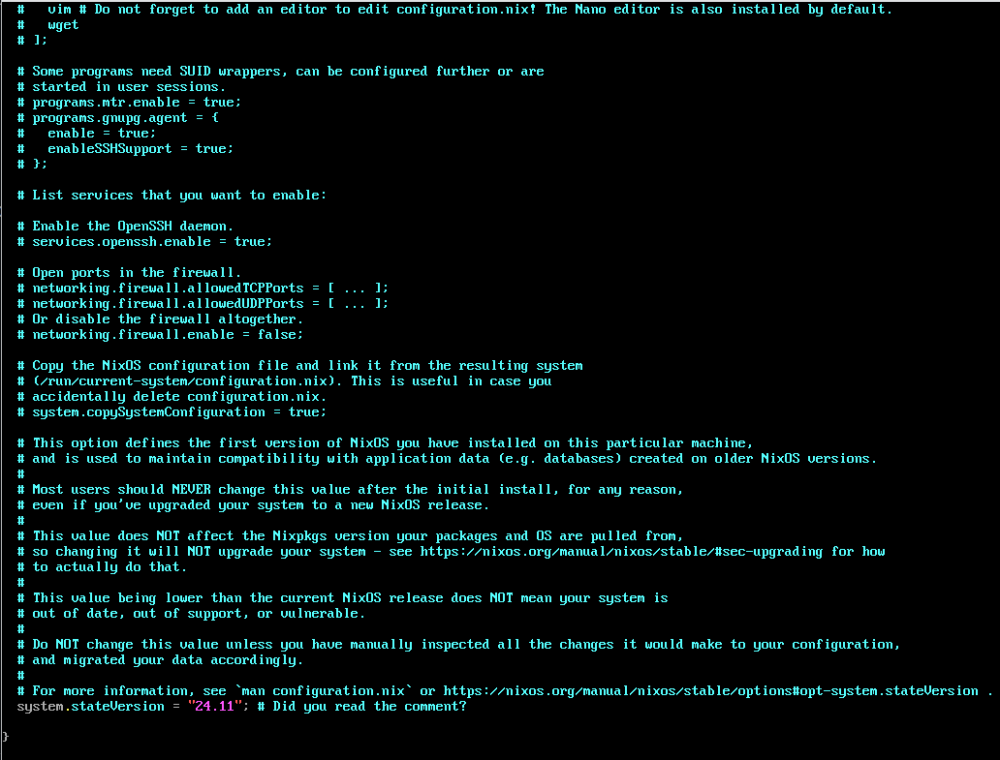

# Здесь будут заметки ко всему

- [Создание загрузочной флешки (Live CD)](#Создание-загрузочной-флешки-Live-CD)
- [Установка-QEMU](#Установка-QEMU)
- [Возимся с NixOS](#Возимся-с-NixOS)
- [Other](#Other)

#### Создание загрузочной флешки Live CD  

if - откуда, of - куда. Можно таким образом создавать бэкапы, утилита мощная  
```bash
sudo dd if=/home/$(whoami)/Downloads/nixos-minimal-24.11.717822.0c0bf9c05738-x86_64-linux.iso of=/dev/sda bs=4M status=progress oflag=sync
```

#### Установка QEMU

```
yay -S fmanager virt-viewer dnsmasq vde2 bridge-utils openbsd-netcat

sudo systemctl start libvirtd.service

sudo systemctl status libvirtd.service
```

После перезагрузки пишет что-то вроде этого:

```cpp
Error starting domain: Requested operation is not valid: network 'default' is not active

Traceback (most recent call last):
  File "/usr/share/virt-manager/virtManager/asyncjob.py", line 71, in cb_wrapper
    callback(asyncjob, *args, **kwargs)
    ~~~~~~~~^^^^^^^^^^^^^^^^^^^^^^^^^^^
  File "/usr/share/virt-manager/virtManager/asyncjob.py", line 107, in tmpcb
    callback(*args, **kwargs)
    ~~~~~~~~^^^^^^^^^^^^^^^^^
  File "/usr/share/virt-manager/virtManager/object/libvirtobject.py", line 57, in newfn
    ret = fn(self, *args, **kwargs)
  File "/usr/share/virt-manager/virtManager/object/domain.py", line 1384, in startup
    self._backend.create()
    ~~~~~~~~~~~~~~~~~~~~^^
  File "/usr/lib/python3.13/site-packages/libvirt.py", line 1390, in create
    raise libvirtError('virDomainCreate() failed')
libvirt.libvirtError: Requested operation is not valid: network 'default' is not active

```

Пробую решение:

```bash
sudo virsh net-define /etc/libvirt/qemu/networks/default.xml
sudo virsh net-start default
sudo virsh net-autostart default
```

И оно сработало


#### Возимся с NixOS

Установка и возня

Если устанавливаем на Vbox, не забываем галку Enable EFI и галку что используем ssd.

После этого момента в этот же день я узнал про qemu...
А там всё удобнее

Отличный гайд на установку

https://devctrl.blog/posts/step-by-step-guide-installing-nix-os-on-virtual-box/

Для удобства нужно подключиться по ssh


На guest:

Проверяем что sshd активен

```
systemctl status sshd
```

Задаём пароль:

```
passwd root
```

Затем вводим команды чтобы узнать ip (либо в qemu view from 'console' to 'details' to 'NIC' )

```
ip r
ip a
```

вывод будет примерно таким:

```

[root@nixos:~]# systemctl status sshd
● sshd.service - SSH Daemon
     Loaded: loaded (/etc/systemd/system/sshd.service; enabled; preset: ignored)
     Active: active (running) since Tue 2025-05-13 11:52:55 UTC; 4h 43min ago
 Invocation: c2ba7a7170c6428d970f1bcd96233a12
    Process: 920 ExecStartPre=/nix/store/q16vr1r6rncxiy3za32sim7shsmk4c9s-unit-script-sshd-pre-start/bin/sshd-pre-start (code=exited, status=0/SUCCESS)
   Main PID: 951 (sshd)
         IP: 184K in, 198K out
         IO: 4.7M read, 0B written
      Tasks: 1 (limit: 9474)
     Memory: 9.5M (peak: 26.7M)
        CPU: 1.707s
     CGroup: /system.slice/sshd.service
             └─951 "sshd: /nix/store/ws4gbyi7zppliyvqv33cxfb2kfw8v69j-openssh-9.9p2/bin/sshd -D -f /etc/ssh/sshd_config [listener] 0 of 10-100 startups"

May 13 11:52:55 nixos sshd-pre-start[949]: |     ...    . .. |
May 13 11:52:55 nixos sshd-pre-start[949]: |    .o++..   .E  |
May 13 11:52:55 nixos sshd-pre-start[949]: | . o++BBB   . .  |
May 13 11:52:55 nixos sshd-pre-start[949]: | .*==O@@+o.+o.   |
May 13 11:52:55 nixos sshd-pre-start[949]: +----[SHA256]-----+
May 13 11:52:55 nixos systemd[1]: Started SSH Daemon.
May 13 11:52:56 nixos sshd[951]: Server listening on 0.0.0.0 port 22.
May 13 11:52:56 nixos sshd[951]: Server listening on :: port 22.
May 13 16:20:42 nixos sshd-session[1408]: Accepted keyboard-interactive/pam for root from 192.168.122.1 port 42000 ssh2
May 13 16:20:42 nixos sshd-session[1408]: pam_unix(sshd:session): session opened for user root(uid=0) by (uid=0)


[root@nixos:~]# ip r
default via 192.168.122.1 dev enp1s0 proto dhcp src 192.168.122.64 metric 1002 
192.168.122.0/24 dev enp1s0 proto dhcp scope link src 192.168.122.64 metric 1002 

[root@nixos:~]# ip a
1: lo: <LOOPBACK,UP,LOWER_UP> mtu 65536 qdisc noqueue state UNKNOWN group default qlen 1000
    link/loopback 00:00:00:00:00:00 brd 00:00:00:00:00:00
    inet 127.0.0.1/8 scope host lo
       valid_lft forever preferred_lft forever
    inet6 ::1/128 scope host noprefixroute 
       valid_lft forever preferred_lft forever
2: enp1s0: <BROADCAST,MULTICAST,UP,LOWER_UP> mtu 1500 qdisc fq_codel state UP group default qlen 1000
    link/ether 52:54:00:2a:93:2d brd ff:ff:ff:ff:ff:ff
    inet 192.168.122.64/24 brd 192.168.122.255 scope global dynamic noprefixroute enp1s0
       valid_lft 3075sec preferred_lft 2456sec
    inet6 fe80::5054:ff:fe2a:932d/64 scope link 
       valid_lft forever preferred_lft forever
```

Замечаем ip адрес

включаем на хосте sshd

```
sudo systemctl start sshd
```

Подключаемся (в моём случае ip адрес гостя был такой: 
  192.168.122.54
) увидел это в default via и в enp1s0 (inet)

```
ssh root@192.168.122.64 -p 22
```


пользуемся cfdisk


При установке форматирование будет примерно такое  
```bash
mkfs.fat -F 32 -n BOOT /dev/sda1
mkswap -L swap /dev/sda2
```

btrfs

```bash
sudo mkfs.btrfs -L NIXOS -f /dev/sda3 # for btrfs
```

для ext4

```bash
mkfs.ext4 -L nixos /dev/sda3
```







subvolumes for btrfs:  
```bash
mount -t btrfs /dev/sda3 /mnt
cd /mnt
btrfs subvolume create @
btrfs subvolume create @home
btrfs subvolume create @nix
btrfs subvolume create @snapshots
cd
umount /mnt
```

Умное монтирование btrfs

```
mount -o compress=zstd,subvol=@ /dev/sda3 /mnt
mkdir -p /mnt/{boot,home,nix,.snapshots}
mount -o compress=zstd,subvol=@home /dev/sda3 /mnt/home
mount -o compress=zstd,subvol=@nix /dev/sda3 /mnt/nix
mount -o compress=zstd,subvol=@snapshots /dev/sda3 /mnt/.snapshots


mount /dev/sda1 /mnt/boot
```

Простое монтирование через ext4

```bash
mount /dev/sda3 /mnt
mount --mkdir /dev/sda1 /mnt/boot
swapon /dev/sda2
mount -t efivarfs efivarfs /sys/firmware/efi/efivars
```

NixOs
```bash
nixos-generate-config --root /mnt

```

Далее очень желательно инициализировать гит репо с конфигом.

```bash
cd /mnt/etc/nixos
git init
git add
  git config --global user.email "<you@example.com>"
  git config --global user.name "<Your Name>"
ssh-keygen
cat /root/.ssh/id_ed25519.pub # примерно так он и будет выглядеть
```
Копируем публичный ключ, вставляем в удалённом репозитории в настройках в блоке ssh.

Создаём репо `nixos` в удалённом GiHub например

```bash
git commit -m "Init NixOS config files"
git remote add origin git@github.com:your_name_on_github/nixos-config.git

git branch -M main
git push -u origin main
```


```bash
nano /mnt/etc/nixos/configuration.nix
nixos-install
```

Ещё недостающие конфиги, но это уже завтра...

```nix
{ config, pkgs, ... }: {
  # Включить Wayland и Hyprland
  programs.hyprland = {
    enable = true;
    xwayland.enable = true;  # Для совместимости с X11-приложениями
  };

  # Графические драйверы (пример для Intel/NVIDIA)
  hardware.opengl.enable = true;
  services.xserver.videoDrivers = [ "nvidia" ];  # Для NVIDIA
  # Или для AMD:
  # hardware.amdgpu.loadInInitrd = true;

  # Пользователь и сессия
  users.users.<ваш_логин> = {
    isNormalUser = true;
    extraGroups = [ "wheel" "video" "render" ];
  };

  # Автовход в TTY (если используете display manager)
  services.displayManager.autoLogin = {
    enable = true;
    user = "<ваш_логин>";
  };

  environment.systemPackages = with pkgs; [
    hyprland
    waybar
    swaylock-effects
    wofi
    kitty  # Терминал
  ];
}
```









вот такая локаль  
```
ru_RU.UTF-8/UTF-8
```
отсюда взято
https://sourceware.org/git/?p=glibc.git;a=blob;f=localedata/SUPPORTED

После установки   
```
nixos-enter --root /mnt -c 'passwd alice'
```

После перезапуска удаляем ключ с хоста:

```
ssh-keygen -R 192.168.122.64
```

затем подключаемся спокойно...

После установки так же слетают ключи `ssh-keygen`

так что нужно заново сгенерить, чтобы и дальше в гит закидывать наш изменяющийся конфиг файл.

Вот некоторые полезные команды

Дистрибутив не такой простой как arch. Там где в arch поиск пакета локально был что то вроде 

```
yay -Qi firefox
```

то в nix всё сложнее

сначала нужно найти пакет...

```
nix-store -q --tree /run/current-system/sw | grep firefox
```

Если что-то отредачили в конфиг файле, нужно перебилдить потом

```bash
sudo nixos-rebuild switch
```

Итого получилось у меня запустить hyprland. Но не запустился kitty. Завтра ещё потыкаю


#### Other

Корректное завершение работы:  
```bash
sudo shutdown -P now
```

Утилитки если вдруг всё сломалось 
```bash
lsblk
fdisk -l
cfdisk
fsck
``` 

iwctl:  
```
iwctl
device list
device <name> set-property Powered on
adapter phy0 set-property Powered on # phy0 - вместо этого подставить то какой у вас адаптер в list
station name scan
station name get-networks
station name scan
station name connect SSID
```

```bash
fsck /dev/nvme0n1p1  # Проверь целостность раздела
```

Пересборка grub:   
```bash
grub-install --target=x86_64-efi --efi-directory=/boot/efi --bootloader-id=GRUB
mkinitcpio -P
grub-mkconfig -o /boot/grub/grub.cfg
```


Пересборка ядра:  
```bash
pacman -S linux linux-zen
mkinitcpio -P
```

Глянуть id разделов
```bash
blkid /dev/nvme1n1p1
```

Troubleshooting  
```bash
fsck.fat -v /dev/nvme1n1p1  # Проверка FAT32 (EFI)
btrfstune -U random /dev/nvme1n1p2
```

Зайти в смонтированные разделы

предварительно смонтировав  
```bash
mount /dev/nvme1n1p2 /mnt           # Корень
mount /dev/nvme1n1p1 /mnt/boot/efi  # EFI

arch-chroot /mnt
```


swap-file (на Arch)

```bash
swapon --show
df -Th /swapfile
sudo rm /swapfile
sudo touch /swapfile
sudo chattr +C /swapfile
sudo fallocate -l 16G /swapfile
sudo chmod 600 /swapfile
sudo mkswap /swapfile
sudo swapon /swapfile
swapon --show
free -h
code src/me/guideall/
```


Проблема с конфликтом файлов   
```bash
error: failed to commit transaction (conflicting files)
linux-firmware-nvidia: /usr/lib/firmware/nvidia/ad103 exists in filesystem
linux-firmware-nvidia: /usr/lib/firmware/nvidia/ad104 exists in filesystem
linux-firmware-nvidia: /usr/lib/firmware/nvidia/ad106 exists in filesystem
linux-firmware-nvidia: /usr/lib/firmware/nvidia/ad107 exists in filesystem
```  
Решаем так:  
```bash
sudo pacman -Rdd linux-firmware
sudo pacman -Syu
sudo pacman -S linux-firmware
```

-Rdd forcibly removes the linux-firmware package without checking dependencies. This is necessary because other packages may depend on it, but you need to clear the conflicting files.

-Syu updates your system, pulling in the new split firmware packages.

-S linux-firmware reinstalls the main firmware package, ensuring all necessary files are properly managed by pacman

    .

This process is confirmed to resolve the conflict and is the approach recommended by both the Arch Linux news and community forums

.
Why is this happening?

    The linux-firmware package was recently split into several sub-packages (e.g., linux-firmware-nvidia, linux-firmware-amdgpu, etc.).

    Files that were previously owned by the monolithic linux-firmware package are now managed by these new split packages.

    If you have not performed the manual intervention, pacman sees these files as "already existing" and refuses to overwrite them, to prevent accidental data loss

    .

Additional Notes

    Always read the Arch Linux front page news before performing major updates, especially when core packages like firmware or the kernel are involved. These types of changes are usually announced there

.

Never manually delete files in /usr/lib/firmware unless specifically instructed by official documentation or trusted sources

    .

If you follow the steps above, your system should update cleanly and the error will be resolved
.
